**Customer Churn Prediction for Telecommunications Media and
Technologies (TMT) companies**  

By
LaShawn Gaines

The mobile telecommunications industry is highly competitive. According to Consumer Affairs, as referenced by [EY](https://www.ey.com/en_us/ecosystems/adapt-your-consumer-data-to-drive-innovation), it is estimated that 97% of all Americans own a smartphone. Because of this, maintaining a customer base cannot simply revolve around attracting new customers. In order to thrive in this competitive market, you must gain customers from other providers. Not only do you have to be able to woo customers from other providers, you must strategize ways to reduce the churn rate thus minimizing the loss of your customer base to other service providers.

In 2019, TechSee conducted a [survey](https://techsee.com/resources/reports/2019-telecom-churn-survey/) of TMT Customer Churn. They found that most telecom companies leveraged reactive methods of retaining their customers. TechSee's survey showed that 61% of the telecom companies attempted to retain their customers by offering discounts or apologies, but only after the customers canceled their contracts. Telecommunications companies have enormous amounts of data on their customers. Can this data somehow be used to build a customer churn prediction model to identify and contact customers who are most likely to churn before they cancel their contracts or service?

**About the Data**

This is an IBM sample dataset located on [kaggle](https://www.kaggle.com/datasets/blastchar/telco-customer-churn/data).  It has a usability score of 8.82. It includes 7,043 records with 21 columns. The data captured is a sample of customers:

-   that left the company within the last month

-   the services the customer signed up for (phone, internet, online security, online backups, device protection, tech support, streaming content)

-   customer account information (tenure, type of contract, payment methods, paperless billing, monthly charges and total charges)

-   Customer demographic data (age, gender, if they are single/partnered, if they have dependents)

**Data wrangling**

With a usability score of 8.82 on kaggle, this dataset didn't require too much in the way of scrubbing. Below are some of the updates I made to the data set:

-   total charges for the customers had an object data type, which I converted to float

-   dropped 11 rows of data with missing values in the total charges column

-   converted some of the descriptive features to numeric in order groupthem into bundles

    -   creating phone_internet feature to count number of customers
        with bundled service

    -   creating a number_of_services feature (count of all services
        subscribed)

-   Dropped the customer ID column as it provides no insights

My preliminary findings from the data wrangling showed that of the final population of 7,032 customers in the data set, 1,869 churned during the month, giving us a churn rate of 26.58%. When grouped by type of services the customer received, the lowest churn was for phone service customers and the highest was for customers leveraging multiple service offerings.

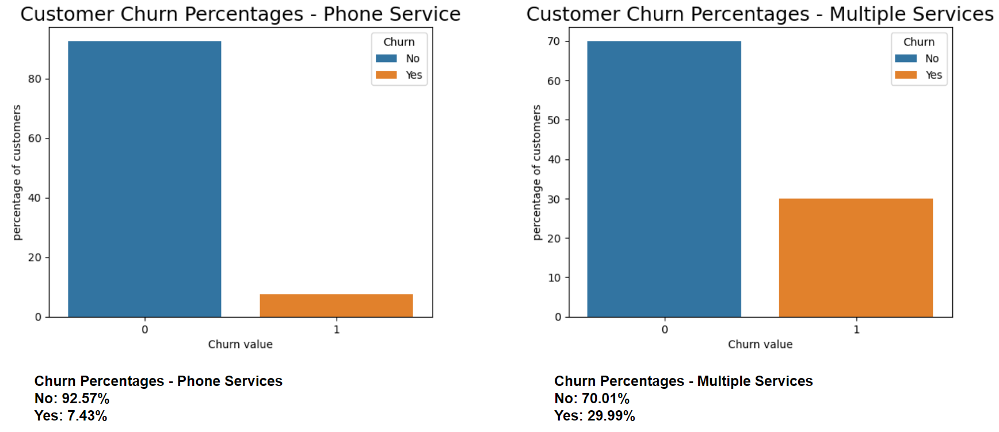

**EDA**

I began my EDA with a number of bivariate analytical charts displaying churn by each of the other categorical features. I observed some interesting relationships. As it relates to customer account features, customers on month-to-month contracts are more likely to churn than those who are on a one-year or two-year contract. This is logical as it is easier for the monthly customer to leave with very few hurdles. In reviewing customer payment methods, I also noted those who pay via electronic check are also more likely to churn versus any other payment method.

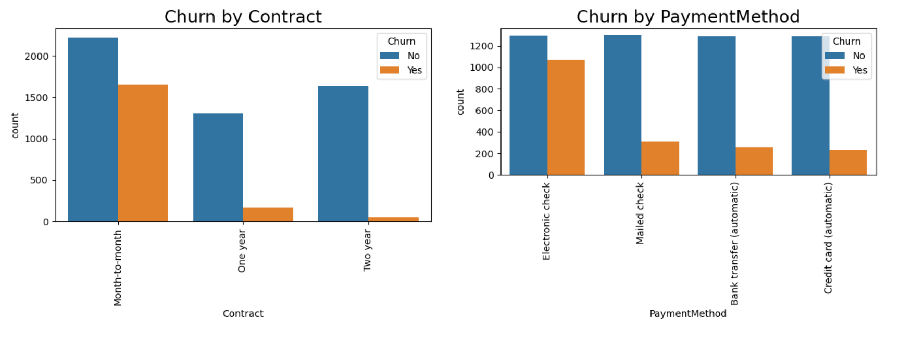

One can also observe some interesting relationships as they relate to the various services offered.

For the consumers subscribing to internet services, those using the fiber optic service are more likely to churn vs shoe on DSL. I also observed that customers who do not subscribe to the online security service are more likely to churn than those who do use it.

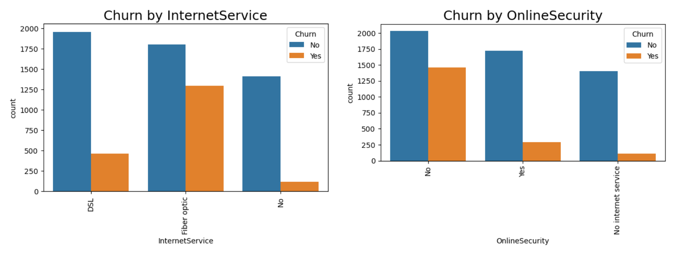

Next, I decided to see just how much these items may or may not be correlated to churn. I used the get_dummies method to encode the categorical features. This took my dataset from 24 columns to 59 columns. After charting the correlation between churn and the other categories, we can see some corroboration to our findings in our bivariate charts.

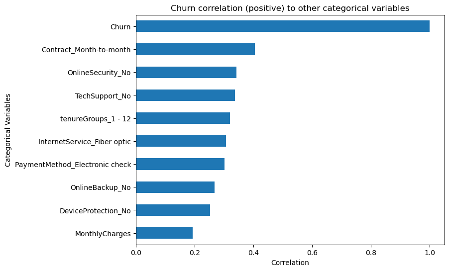

Although the correlation is somewhat weak between churn and monthly charges, we have a significant portion of our active customer base with monthly charges between \$20-40 per month. There also seems to be a spike in churn for those customers paying between \$80-\$100 per month. Business leaders may want to review their price/mix strategies to maximize revenues.

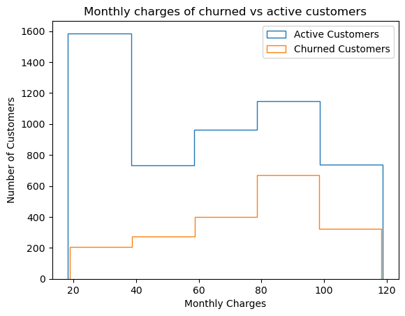

**Preprocessing**

After importing my scrubbed data files, I used dummy encoding (dropping the first feature) to prepare my categorical variables for machine learning. My final result was a data frame with 7,032 records and 40 columns. My next step was to split my data into training and test sets.

While reviewing the monthly charges and total charges histograms, it was clear that the data was somewhat skewed. They are also of much higher magnitude than all the other fields. Therefore, I chose to scale my data using sklearn's StandardScaler.

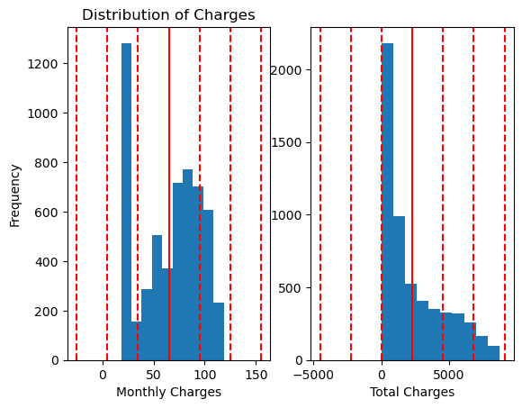

Next, given the nature of the dataset, an imbalance between the majority (active customers) and minority (churned) customers is to be expected. We found this to be true.

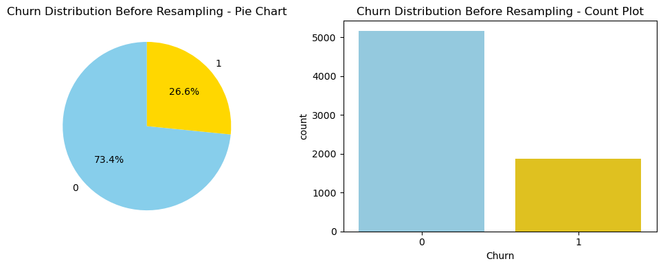

As this dataset is relatively small, we determined that it was best to use an over-sampling technique vs under sampling. We did not want to lose any of the predictive power for classifying the majority class in our modeling. The SMOTE + Tomek links sampling method was applied.

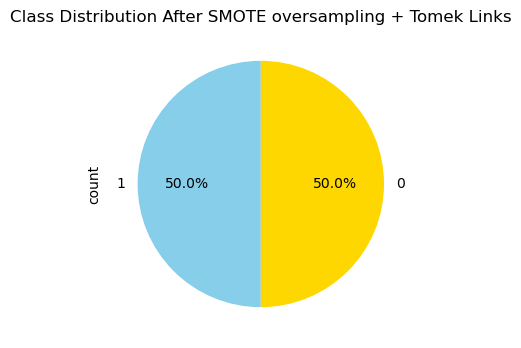

**Modeling**

Given that this is a classification model, the following algorithms were selected to predict customer churn:

-   Logistic regression

-   Random Forest

-   Gradient Boosting

-   k nearest Neighbors

-   Support Vector Classifier

Each algorithm was first run with the default parameters to establish a baseline. This baseline was then compared to the results after hyperparameter tuning the model using a grid search with 5-fold cross validation. Given that this is a classification model, I have chosen to measure them based on recall. Assuming that it is better to minimize the number of false negatives. With that said, the logistic regression model produced the highest recall score for churned customers. The recall scores for the base model and the hyperparameter-tuned model were nearly identical.

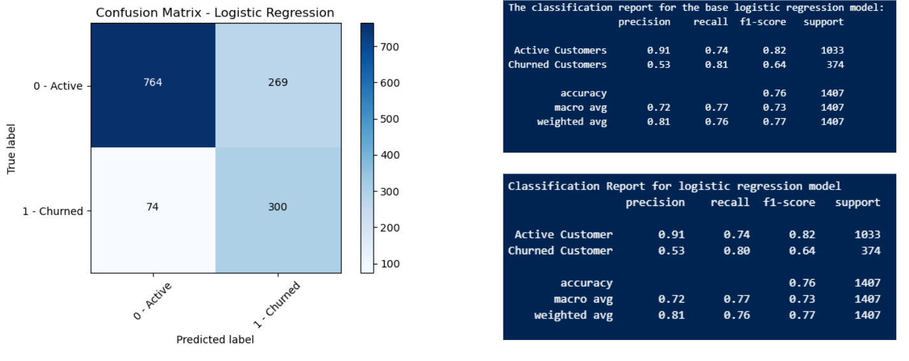

It is also worth noting that there is the potential for a high proportion of false positives. If this model is used for determining which customers to contact, we may have quite a bit of wasted resources to make those additional contacts.

Coming in just behind logistic regression, was the Support vector classifier model. Although it performed relatively well compared to Random Forest, Gradient Boosting and KNN, it is computationally very expensive.

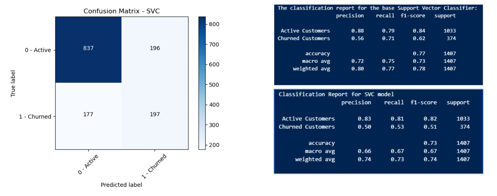

Random Forest appeared to reduce the number of false positives, but with the caveat of producing more false negatives. Gradient boosting produced nearly identical results. K-Nearest Neighbors produced the least reliable results.

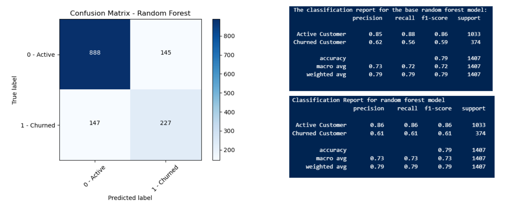

When reviewing the respective ROC curves, all the model performances were relatively comparable. However, given the best recall performance, my recommendation would be the logistic regression model. 

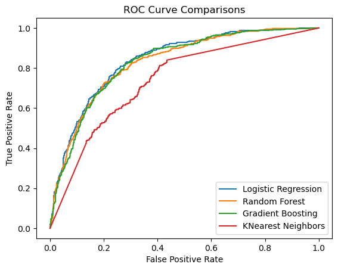

**Potential future prediction model enhancements**

Enhancements could include additional preprocessing steps, such as filtering the features down to the most influential. This could reduce the computational resources needed to run all the algorithms. I leveraged the StandardScaler in this model to scale my data. Perhaps leveraging MinMaxScaler or a combination of the two scalers could improve performance. Lastly, I would also potentially try different resampling methods, such as Random over sampling or ADASYN.

Lastly, in each of the algorithms, the results after hyperparameter tuning were close to the base measurement or in some cases worse. This could perhaps be the result of paring down the parameters in the param_grids to avoid overloading computational resources. With a filtered list of features by importance, may allow additional resources to achieve better results.

**Business recommendations for customer retention**

Historically speaking, the mobile telecom industry required one-to-two-year contracts with customers as a part of doing business. Often-times they would include a mobile phone in the price of your service. As the devices are quite expensive, ensuring the customer was locked into a contract was necessary to cover equipment costs in addition to the service provided.

In 2013, T-mobile launched their "un-carrier" strategy, which eliminated customer contracts, thus beginning the now-normal month-to-month service agreements with customers. This just reiterates the importance of reducing churn.

During the EDA process, we noted several services that were negatively correlated to churn, thus making it less likely the customer would churn if they used that service. Perhaps bundling these services into Phone or Internet could reduce the customers likelihood of churning. Those services are:

-   Tech Support

-   Online Security

-   Online Back-up service

We also noted that consumers on Fiber Optic internet were more likely to churn. Further research should be considered to ensure there isn't a performance issue. It was also noted that churned customers paying between \$80 - \$100 a month demonstrated the highest frequency. Therefore, proactively contacting these customers with potential discounts or additional service bundles may help stifle the urge for the customer to leave for a competitor.

Finally, there were some billing and payment methods that were correlated with churn. Customers leveraging paperless billing were more likely to churn than those with paper billing. Additional research is needed to ensure that the bills are being delivered to the customer. They could potentially be getting caught in a spam filter. Likewise, those paying with electronic checks were more likely to churn. There may be systemic issues that need to be resolved to enhance the customer's experience with electronic checks.
